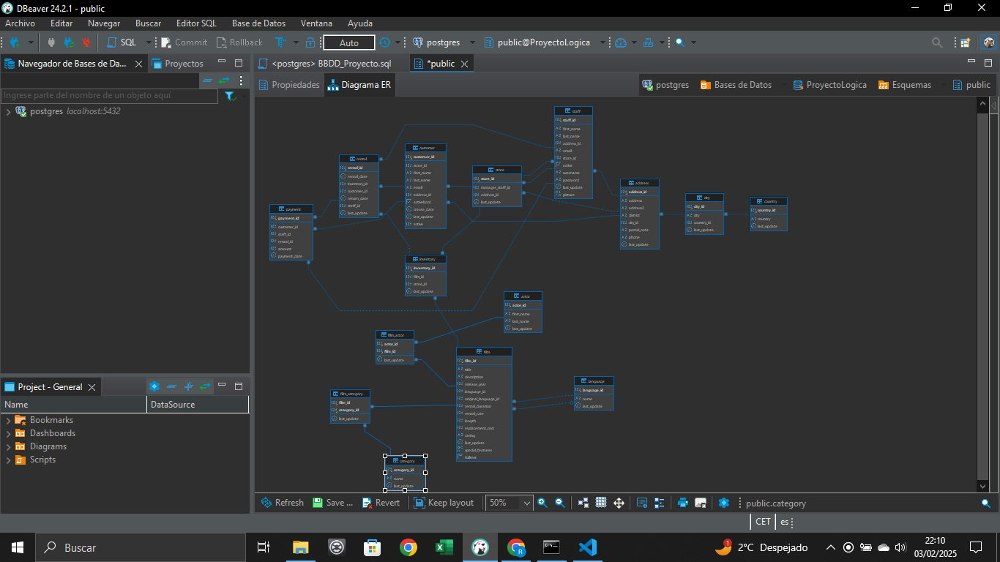

# ProyectoLogicaSql
Ejercicios proyecto SQL 

Utilizaremos DBeaver para crear los scripts.
En primer lugar creamos el esquema de nuestra BBDD.
Vamos ejecutando las consultas, basándonos en las clases de los módulos, y clases en directo. 